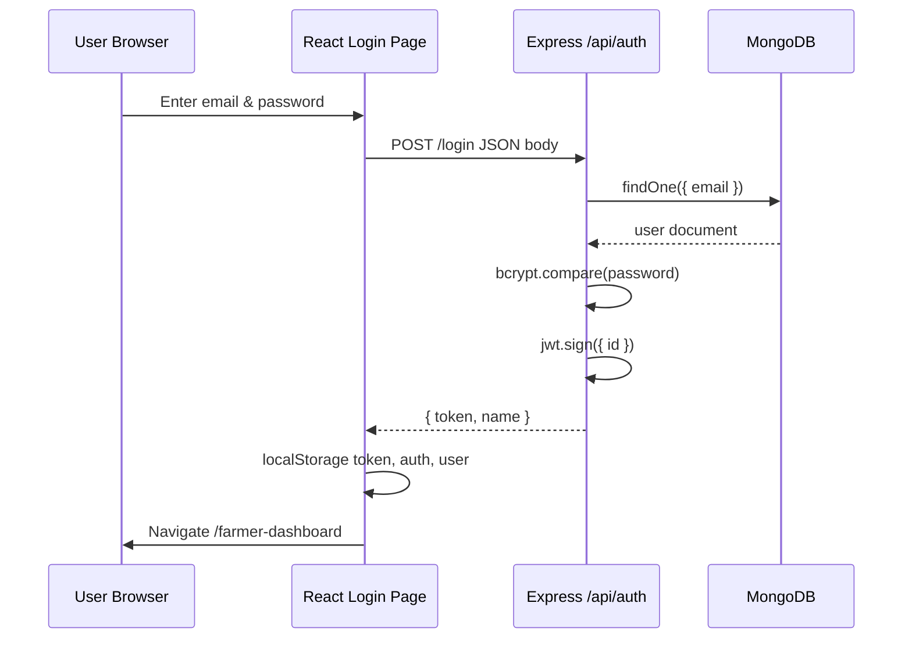
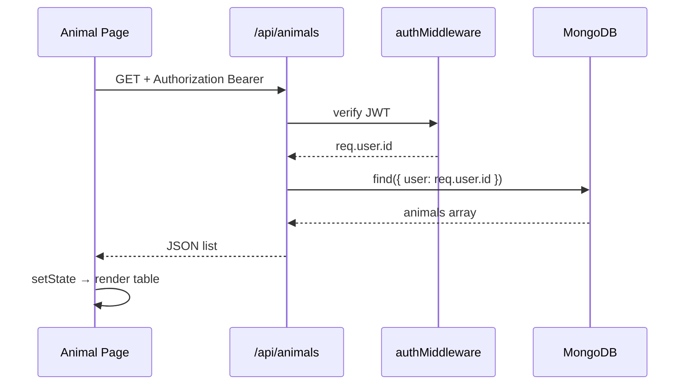

---
<!-- page break when printing -->


# CATTLECLOUD
## Smart Livestock Management System

### A Minor Project Report

---

**Submitted in partial fulfillment of the requirements for the award of**

**Bachelor of Technology / Bachelor of Computer Applications / Diploma in Computer Science**

*(Replace with your actual degree and institution name)*

---

| | |
|---|---|
| **Project Title** | CattleCloud — Smart Livestock Management System |
| **Project Type** | Full-Stack Web Application |
| **Academic Session** | 2025–2026 |
| **Report Date** | May 2026 |
| **Repository** | `minorproject` (Monorepo) |

---

**Developed By:**  
*(Student Name 1 — Roll No.)*  
*(Student Name 2 — Roll No.)*  
*(Add team members as applicable)*

**Under the Guidance of:**  
*(Guide Name, Designation)*

**Department of:**  
*(Computer Science / Information Technology)*

**Institution:**  
*(College / University Name, City)*

---

> **Document control**  
> Version: 2.0 (Extended Edition)  
> Estimated length: **~35 pages** when printed at 12pt with standard margins  
> Format: Markdown (convert to PDF via Pandoc, VS Code, or Word for submission)

---


---
<!-- page break when printing -->


## CERTIFICATE

This is to certify that the project report entitled **“CattleCloud — Smart Livestock Management System”** submitted by **\*\*\*\*\*\*\*\*\*** to **\*\*\*\*\*\*\*\*\* University/College** in partial fulfillment of the requirements for the award of **\*\*\*\*\*\*\*\*\*** is a record of bonafide work carried out by them under my supervision.

The matter embodied in this report has not been submitted earlier for the award of any other degree/diploma to the best of my knowledge.

<br><br>

**Guide Name**  
Designation  
Department  
Signature: _______________  
Date: _______________

<br><br>

**Head of Department**  
Signature: _______________  
Date: _______________

---


---
<!-- page break when printing -->


## DECLARATION

We hereby declare that the project work entitled **“CattleCloud — Smart Livestock Management System”** submitted to **\*\*\*\*\*\*\*\*\* Institution** is an authentic record of our own work carried out during the academic year **2025–2026** under the supervision of **\*\*\*\*\*\*\*\*\***.

This work has not been submitted elsewhere for a degree or diploma. We have given due acknowledgments wherever materials from other sources have been used.

<br><br>

| Student Name | Signature | Date |
|--------------|-----------|------|
| | | |
| | | |

---


---
<!-- page break when printing -->


## ACKNOWLEDGEMENT

We express our sincere gratitude to our project guide **\*\*\*\*\*\*\*\*\*** for continuous support, valuable suggestions, and encouragement throughout the development of CattleCloud.

We thank the **Head of the Department** and all faculty members of **\*\*\*\*\*\*\*\*\*** for providing laboratory facilities and academic guidance.

We are grateful to our families and peers for their motivation during the implementation and testing phases of this application.

Finally, we acknowledge the open-source communities behind **React**, **Node.js**, **Express**, **MongoDB**, and **Vite**, whose tools made this project feasible within an academic timeline.

<br><br>

**Team Members**

---


---
<!-- page break when printing -->


## ABSTRACT

Livestock farming remains a critical sector in rural economies, yet many small and medium farmers continue to rely on informal record-keeping. Missed vaccination schedules, inconsistent milk yield tracking, and poor visibility into farm expenses directly affect productivity and income. **CattleCloud** (branded in the user interface) addresses these challenges through a browser-based **Smart Livestock Management System** that centralizes operational data in one secure dashboard.

The system is implemented as a **three-tier web application**. The **presentation tier** is a React 19 single-page application built with Vite, offering bilingual support in **English and Hindi**. The **application tier** is a RESTful API developed with Express 5 and Node.js, using JSON Web Tokens (JWT) and bcrypt for authentication. The **data tier** is MongoDB, accessed through Mongoose schemas for users, animals, milk records, vaccinations, and financial transactions.

Key capabilities include farmer registration and login, per-user data isolation, animal registry with Indian cattle and buffalo breeds, milk production logging with revenue estimation at ₹70 per litre, vaccination scheduling with automatic booster date calculation, and expense/profit ledger with net farm profit/loss summary. A marketing landing page, Chart.js-based farmer dashboard, and Netlify deployment configuration complete the solution.

The project demonstrates practical full-stack engineering suitable for academic evaluation. Certain features remain in prototype state—department-level analytics dashboard, server-integrated password recovery, and environment-based API configuration—which are documented as future enhancements.

**Keywords:** Livestock management, MERN-style stack, React, Express, MongoDB, JWT, dairy farming, vaccination tracking, bilingual web application.

---


---
<!-- page break when printing -->


## TABLE OF CONTENTS

| Sr. | Chapter | Page Ref. |
|-----|---------|-----------|
| 1 | [Introduction](#chapter-1-introduction) | |
| 2 | [Literature Survey & Existing Systems](#chapter-2-literature-survey--existing-systems) | |
| 3 | [Problem Definition & Objectives](#chapter-3-problem-definition--objectives) | |
| 4 | [System Analysis](#chapter-4-system-analysis) | |
| 5 | [System Design](#chapter-5-system-design) | |
| 6 | [Technology Stack](#chapter-6-technology-stack) | |
| 7 | [Implementation — Backend](#chapter-7-implementation--backend) | |
| 8 | [Implementation — Frontend](#chapter-8-implementation--frontend) | |
| 9 | [Database Design](#chapter-9-database-design) | |
| 10 | [Security & Authentication](#chapter-10-security--authentication) | |
| 11 | [User Interface & Screen Documentation](#chapter-11-user-interface--screen-documentation) | |
| 12 | [Algorithms & Business Logic](#chapter-12-algorithms--business-logic) | |
| 13 | [API Reference (Complete)](#chapter-13-api-reference-complete) | |
| 14 | [Testing & Validation](#chapter-14-testing--validation) | |
| 15 | [Deployment & DevOps](#chapter-15-deployment--devops) | |
| 16 | [Results & Discussion](#chapter-16-results--discussion) | |
| 17 | [Limitations & Known Issues](#chapter-17-limitations--known-issues) | |
| 18 | [Future Scope](#chapter-18-future-scope) | |
| 19 | [Conclusion](#chapter-19-conclusion) | |
| A | [Appendices](#appendix-a-project-directory-structure) | |
| B | [Glossary](#appendix-b-glossary) | |
| C | [References](#appendix-c-references) | |
| D | [Viva Preparation](#appendix-d-viva-preparation-question-bank) | |

---


---
<!-- page break when printing -->


# CHAPTER 1 — INTRODUCTION

## 1.1 Background

India is among the largest milk-producing countries globally, with millions of households engaged in dairy and mixed livestock farming. Despite digital initiatives in agriculture, a significant portion of cattle owners still maintain records manually—notebooks, wall calendars, or verbal memory—for animal identity, milk quantities, veterinary visits, and cash flows.

Manual systems introduce errors and delays. For example:

- A missed **Foot and Mouth Disease (FMD)** booster can affect herd health and marketability.
- Without daily milk logs, farmers cannot identify high-yield versus low-yield animals.
- Expenses scattered across feed, labor, and veterinary bills make **net profitability** unclear.

Web applications accessible from low-cost smartphones can bridge this gap without requiring installation of heavy desktop software. **CattleCloud** was conceived as an academic full-stack project to model such a solution with modern, industry-relevant technologies.

## 1.2 About the Project

**CattleCloud** (UI name; repository folder: `smart-livestock-dashboard`) is a web-based livestock management platform targeting **individual farmers**. After authentication, a farmer can:

1. Register and maintain animals with breed, age, gender, purchase cost, and health status.
2. Record milk production per animal per day.
3. Maintain vaccination history with computed next-due dates.
4. Track expenses and profits under categorized ledgers.
5. View a dashboard with KPI cards and weekly milk production charts.

The system also includes a **public marketing website** (landing page) with feature descriptions, FAQ, and calls-to-action for registration.

## 1.3 Scope of the Project

### In Scope

- User registration and login against MongoDB.
- JWT-based session tokens for API authorization.
- CRUD operations (Create, Read, Delete) for animals, milk, vaccinations, and expenses.
- User-scoped data access on the server.
- Bilingual UI strings (English / Hindi).
- Farmer dashboard with Chart.js visualization.
- Profile management with image upload (base64 stored in database).
- Frontend build and Netlify SPA configuration.

### Out of Scope (Current Version)

- SMS/email notifications for vaccine reminders.
- Real-time IoT sensor integration (automated milk meters, RFID tags).
- Payment gateway or government subsidy workflow automation.
- Native Android/iOS applications.
- Multi-farm enterprise hierarchy (owner → workers).
- Fully functional government **department dashboard** (placeholder only).

## 1.4 Organization of the Report

This report follows standard software engineering documentation: analysis, design, implementation, testing, deployment, limitations, and future work. Detailed screen-level documentation is provided in Chapter 11 for viva and demonstration preparation.

## 1.5 Target Users

| User Type | Description | System Support |
|-----------|-------------|----------------|
| **Farmer** | Primary operator managing own herd | Full module access after login |
| **Guest** | Visitor exploring product | Landing page only |
| **Department official** | Aggregated regional view | Route exists; data is static placeholder |

---


---
<!-- page break when printing -->


# CHAPTER 2 — LITERATURE SURVEY & EXISTING SYSTEMS

## 2.1 Traditional Manual Systems

Traditional farm management relies on paper registers. Advantages include zero technology cost and no learning curve. Disadvantages include:

- No automatic search or filtering.
- No aggregation (totals, charts) without manual calculation.
- High risk of data loss (physical damage, misplacement).
- Difficult backup and sharing with veterinarians or cooperatives.

## 2.2 Spreadsheet-Based Systems

Farmers and cooperatives often use Microsoft Excel or Google Sheets. These improve calculability but lack:

- Structured validation (duplicate animal IDs, invalid vaccine names).
- Role-based access control.
- Mobile-optimized workflows without custom templates.
- Integrated authentication per farmer.

## 2.3 Commercial Livestock Software

Commercial solutions (farm ERP systems, herd management SaaS) offer comprehensive modules: breeding genetics, inventory, payroll, and compliance reporting. They are often:

- Expensive for smallholders.
- Over-engineered for a minor project scope.
- Dependent on vendor lock-in and training.

**CattleCloud** intentionally scopes down to core modules teachable within one academic semester while using the same architectural patterns (SPA + REST + document database).

## 2.4 Government and Cooperative Portals

Various regional portals exist for subsidy registration and cooperative milk collection. These typically do not provide per-farmer private herd notebooks. CattleCloud complements such systems by focusing on **private operational data** rather than public scheme enrollment.

## 2.5 Research & Technology Trends

| Trend | Relevance to CattleCloud |
|-------|--------------------------|
| Cloud-hosted databases (MongoDB Atlas) | Scalable persistence; used via `MONGO_URI` |
| JWT stateless auth | Suitable for SPA backends |
| Progressive Web Apps (PWA) | Possible future enhancement |
| Bilingual rural interfaces | Implemented via translation dictionary |
| Data visualization | Chart.js on farmer dashboard |

## 2.6 Comparative Summary

| Feature | Paper | Excel | CattleCloud |
|---------|-------|-------|-------------|
| Search/filter animals | Poor | Medium | Yes |
| Per-user cloud storage | No | Manual | Yes (MongoDB) |
| Vaccine reminder logic | No | Manual | Partial (UI alerts) |
| Mobile browser access | N/A | Medium | Yes |
| Auth & privacy | N/A | Weak | JWT + user filter |
| Cost | Low | Low/Medium | Hosting dependent |

---


---
<!-- page break when printing -->


# CHAPTER 3 — PROBLEM DEFINITION & OBJECTIVES

## 3.1 Problem Statement

> *Small and medium livestock farmers lack an affordable, simple, and language-accessible digital system to record animals, milk yield, vaccinations, and expenses in one place, leading to operational inefficiency and financial opacity.*

## 3.2 Need for the System

1. **Health compliance** — Timely vaccinations reduce disease outbreaks.
2. **Productivity** — Milk logs help identify best-performing animals.
3. **Financial clarity** — Combined expense and profit entries support net margin understanding.
4. **Digital literacy** — Simple forms and Hindi language lower adoption barriers.
5. **Academic learning** — Demonstrates end-to-end full-stack development.

## 3.3 Objectives

### Primary Objectives

| ID | Objective | Success Criteria |
|----|-----------|------------------|
| O1 | Secure user accounts | Register/login works; passwords hashed |
| O2 | Animal registry | Add/list/delete animals per user |
| O3 | Milk tracking | Records stored and shown in table + dashboard |
| O4 | Vaccination records | Schedule stored with next due date |
| O5 | Financial ledger | Expense/profit entries with net summary |
| O6 | Dashboard analytics | KPI cards + weekly bar chart |
| O7 | Bilingual UI | Toggle EN/HI on key screens |

### Secondary Objectives

| ID | Objective | Status |
|----|-----------|--------|
| S1 | Department aggregate dashboard | Not implemented (static UI) |
| S2 | Email-based password reset | Not implemented (localStorage prototype) |
| S3 | Production deployment (full stack) | Frontend config only |

## 3.4 Hypothesis

If farmers use a centralized digital ledger for milk and health events, they will spend less time reconciling records and can make faster decisions on animal care and selling milk—assuming internet access and basic smartphone availability.

## 3.5 Constraints

- Development time bounded by academic calendar.
- Single MongoDB instance (no sharding).
- Hardcoded milk price (₹70/L) for revenue estimation.
- API base URL fixed to `localhost:5000` in development.

---


---
<!-- page break when printing -->


# CHAPTER 4 — SYSTEM ANALYSIS

## 4.1 Existing Workflow (As-Is)

```
Farmer → Paper notebook → Manual sums at month end
       → Optional Excel → Copy-paste to share with vet
```

Pain points: duplication, no alerts, no per-animal history in one view.

## 4.2 Proposed Workflow (To-Be)

```
Farmer → Browser → CattleCloud SPA → REST API → MongoDB
                 ↓
         Dashboard / Tables / Alerts
```

## 4.3 Stakeholder Analysis

| Stakeholder | Interest | Interaction |
|-------------|----------|-------------|
| Farmer | Daily data entry | Primary user |
| Veterinarian | Health history | Indirect (farmer shows records) |
| Dairy cooperative | Milk volume | Future integration |
| Project evaluator | Code quality, demo | Reads report, watches viva |
| Developer team | Learning MERN patterns | Builds system |

## 4.4 Functional Requirements

### FR-1 Authentication

- **FR-1.1** User shall register with name, email, password.
- **FR-1.2** User shall login and receive JWT.
- **FR-1.3** Protected pages shall require authentication flag.

### FR-2 Animal Management

- **FR-2.1** User shall add animal with ID, breed, age, gender, cost, health.
- **FR-2.2** User shall view list of own animals only.
- **FR-2.3** User shall delete own animals.
- **FR-2.4** User shall search animals by ID substring.

### FR-3 Milk Management

- **FR-3.1** User shall log milk quantity per animal per date.
- **FR-3.2** System shall display per-record income at configured rate.
- **FR-3.3** User shall delete milk records.

### FR-4 Vaccination

- **FR-4.1** User shall select vaccine from predefined list.
- **FR-4.2** System shall compute upcoming booster date from rules.
- **FR-4.3** UI shall warn if booster due within 3 days.

### FR-5 Expenses

- **FR-5.1** User shall record type Expense or Profit.
- **FR-5.2** Categories shall depend on type selected.
- **FR-5.3** System shall compute totals and net profit/loss.

### FR-6 Dashboard

- **FR-6.1** Display animal count, milk metrics, farm score.
- **FR-6.2** Display weekly milk bar chart.

## 4.5 Non-Functional Requirements

| ID | Category | Requirement |
|----|----------|-------------|
| NFR-1 | Performance | API response < 2s on LAN for typical datasets |
| NFR-2 | Usability | Forms with labels; bilingual labels |
| NFR-3 | Security | Passwords hashed; JWT on protected routes |
| NFR-4 | Scalability | User-scoped queries (horizontal scaling possible later) |
| NFR-5 | Maintainability | Modular route files per domain |
| NFR-6 | Portability | Browser-based; OS independent |

## 4.6 Feasibility Study

### Technical Feasibility

**High.** React and Node ecosystems are mature; MongoDB free tier available.

### Economic Feasibility

**High for demo.** Open-source stack; optional paid hosting (Netlify free tier, MongoDB Atlas free tier).

### Operational Feasibility

**Medium.** Requires farmer internet access; training minimal due to simple UI.

---


---
<!-- page break when printing -->


# CHAPTER 5 — SYSTEM DESIGN

## 5.1 Architectural Pattern

The project uses **Client–Server architecture** with **REST API** communication. It aligns with a simplified **MERN** stack (MongoDB, Express, React, Node) though the frontend is Vite-powered rather than Create React App.

```
┌──────────────────────────────────────────────────────────────┐
│                    PRESENTATION LAYER                         │
│  React Components (Pages, Layout, Charts, Forms)              │
│  State: useState, useEffect, localStorage                     │
└────────────────────────────┬─────────────────────────────────┘
                             │ HTTP/JSON
┌────────────────────────────▼─────────────────────────────────┐
│                    APPLICATION LAYER                          │
│  Express Routers + authMiddleware (JWT)                     │
└────────────────────────────┬─────────────────────────────────┘
                             │ Mongoose
┌────────────────────────────▼─────────────────────────────────┐
│                      DATA LAYER                               │
│  MongoDB Collections                                          │
└──────────────────────────────────────────────────────────────┘
```

## 5.2 Component Diagram (Logical)

```
server.js
 ├── authRoutes      → User model
 ├── userRoutes      → User model (profile, image)
 ├── animalRoutes    → Animal model
 ├── milkRoutes      → Milk model
 ├── vaccinationRoutes → Vaccination model
 └── expenseRoutes   → Expense model

App.jsx
 ├── Public: Landing, Login, Register, ForgotPassword
 └── Private: Layout → Sidebar, Topbar, Profile
              └── Pages: Dashboard, Animal, Milk, Vaccination, Expenses
```

## 5.3 Data Flow — Login Sequence



## 5.4 Data Flow — Protected Resource Read



## 5.5 Module Decomposition

| Module | Responsibility |
|--------|----------------|
| **Auth** | Identity lifecycle |
| **Users** | Profile read/update image |
| **Animals** | Herd registry |
| **Milk** | Production diary |
| **Vaccinations** | Preventive health schedule |
| **Expenses** | Farm accounting |
| **i18n** | Translation dictionary |
| **Layout** | Shell navigation |

## 5.6 Design Decisions & Rationale

| Decision | Rationale | Trade-off |
|----------|-----------|-----------|
| MongoDB documents | Flexible fields per record type | No strict SQL joins |
| JWT vs sessions | Stateless API, SPA-friendly | Token storage security considerations |
| fetch vs axios in pages | Simplicity | Duplicated base URL |
| Inline styles + CSS classes | Rapid UI iteration | Less design system consistency |
| Delete-only (no PUT) | Reduced scope | Cannot edit records in-place |
| Base64 profile images | No separate file server | Large documents in DB |

---


---
<!-- page break when printing -->


# CHAPTER 6 — TECHNOLOGY STACK

## 6.1 Frontend Technologies

| Technology | Version | Role |
|------------|---------|------|
| **React** | 19.2 | Component-based UI |
| **React DOM** | 19.2 | DOM rendering |
| **Vite** | 7.3 | Dev server, HMR, production bundling |
| **React Router** | 7.13 | Client-side routing |
| **Chart.js** | 4.5 | Chart rendering engine |
| **react-chartjs-2** | 5.3 | React wrapper for Chart.js |
| **Recharts** | 3.7 | Listed dependency (optional/alternate charts) |
| **Axios** | 1.13 | HTTP client (stub file, not used in pages) |
| **Lucide React** | 0.575 | Icons (available) |
| **React Icons** | 5.6 | Icons (available) |
| **ESLint** | 9.x | Static analysis |

### Why React?

- Component reusability (`Card`, `Layout`, `Profile`).
- Large ecosystem and industry adoption.
- Hooks (`useState`, `useEffect`) simplify data fetching patterns.

### Why Vite?

- Faster cold start than legacy bundlers.
- Native ES modules in development.
- Simple `npm run build` for Netlify.

## 6.2 Backend Technologies

| Technology | Version | Role |
|------------|---------|------|
| **Node.js** | LTS | JavaScript runtime |
| **Express** | 5.2 | HTTP routing, middleware |
| **Mongoose** | 9.2 | ODM for MongoDB |
| **jsonwebtoken** | 9.0 | Token issue/verify |
| **bcryptjs** | 3.0 | Password hashing |
| **cors** | 2.8 | Cross-origin headers |
| **dotenv** | 17.3 | Environment configuration |

## 6.3 Database

**MongoDB** stores JSON-like BSON documents. Collections emerge from Mongoose model names (typically pluralized lowercase: `users`, `animals`, `milks`, etc.).

## 6.4 Development Tools

- **npm** — package management for both packages.
- **Git** — version control (repository initialized).
- **Browser DevTools** — network inspection for API debugging.
- **MongoDB Compass** (recommended) — GUI for viewing collections.

## 6.5 Deployment Stack

| Component | Platform | Configuration File |
|-----------|----------|-------------------|
| Frontend static hosting | Netlify (configured) | `netlify.toml`, `public/_redirects` |
| Backend | Not configured in repo | Manual / cloud VM |
| Database | Local or MongoDB Atlas | `MONGO_URI` in `.env` |

---


---
<!-- page break when printing -->


# CHAPTER 7 — IMPLEMENTATION — BACKEND

## 7.1 Server Bootstrap (`server.js`)

The entry file performs:

1. `dotenv.config()` — loads environment variables.
2. Creates Express `app`.
3. Applies `cors()` globally.
4. Parses JSON bodies up to **10 MB** (supports base64 profile images).
5. Connects MongoDB via `mongoose.connect(process.env.MONGO_URI)`.
6. Mounts six route prefixes.
7. Defines health route `GET /`.
8. Listens on `process.env.PORT`.

## 7.2 Authentication Routes (`authRoutes.js`)

### Register — `POST /api/auth/register`

**Request body:**

```json
{
  "name": "Ramesh Kumar",
  "email": "ramesh@gmail.com",
  "password": "securePass123"
}
```

**Processing:**

1. Extract fields from `req.body`.
2. `bcrypt.hash(password, 10)`.
3. `new User({ name, email, password: hashed })`.
4. `user.save()`.
5. Return `{ message: "User registered" }`.

**Note:** Frontend additionally validates Gmail suffix and 10-digit phone (phone not persisted).

### Login — `POST /api/auth/login`

**Response on success:**

```json
{
  "token": "eyJhbGciOiJIUzI1NiIsInR5cCI6IkpXVCJ9...",
  "name": "Ramesh Kumar"
}
```

JWT payload: `{ id: user._id }`, expires in **1 day**, signed with `process.env.JWT_SECRET`.

## 7.3 User Routes (`userRoutes.js`)

| Endpoint | Method | Middleware | Description |
|----------|--------|------------|-------------|
| `/api/users/profile` | GET | protect | Returns name, email, image |
| `/api/users/upload` | PUT | protect | Updates `image` field |

Profile query uses `.select("-password")` to omit hash from response.

## 7.4 Animal Routes (`animalRoutes.js`)

**Create** maps frontend `id` → database `animalId`:

```javascript
const animal = new Animal({
  user: req.user.id,
  animalId: req.body.id,
  breed: req.body.breed,
  // ...
});
```

**List** returns formatted objects:

```javascript
{
  id: a.animalId,
  breed: a.breed,
  age: a.age,
  gender: a.gender,
  cost: a.cost,
  health: a.health,
  _id: a._id
}
```

**Security:** All operations include `user: req.user.id` filter.

## 7.5 Milk Routes (`milkRoutes.js`)

- **POST** spreads `req.body` and adds `user: req.user.id`.
- **GET** returns all milk documents for user.
- **DELETE** removes by `_id` and `user`.

Expected body fields: `animalId`, `date`, `quantity`.

## 7.6 Vaccination Routes (`vaccinationRoutes.js`)

Stores: `animalId`, `breed`, `vaccineName`, `date`, `upcomingDate` (computed on frontend).

## 7.7 Expense Routes (`expenseRoutes.js`)

Stores: `type` (`Expense` | `Profit`), `category`, `amount`, `date`, `description`.

## 7.8 Middleware (`authMiddleware.js`)

```javascript
export const protect = (req, res, next) => {
  // Extract Bearer token
  // jwt.verify(token, process.env.JWT_SECRET)
  // req.user = decoded
  // else 401
};
```

## 7.9 Dead / Duplicate Code

| File | Issue |
|------|-------|
| `controllers/authcontroller.js` | Not imported; uses hardcoded `"SECRET123"` and `role` field absent from schema |

**Recommendation:** Remove or merge to avoid security confusion during viva.

---


---
<!-- page break when printing -->


# CHAPTER 8 — IMPLEMENTATION — FRONTEND

## 8.1 Application Entry (`main.jsx`)

**Current structure:**

```javascript
import { LanguageProvider } from "./context/LanguageContext";

<LanguageProvider>
  <App />
</LanguageProvider>

ReactDOM.createRoot(document.getElementById("root")).render(
  <BrowserRouter>
    <App />
  </BrowserRouter>
);
```

**Issue:** Orphan JSX outside `createRoot` may prevent compilation; `LanguageProvider` does not wrap the rendered tree. Language is managed via props from `App.jsx` instead.

**Recommended fix:**

```javascript
ReactDOM.createRoot(document.getElementById("root")).render(
  <BrowserRouter>
    <LanguageProvider>
      <App />
    </LanguageProvider>
  </BrowserRouter>
);
```

## 8.2 Routing (`App.jsx`)

| Path | Component | Auth |
|------|-----------|------|
| `/` | Landing | Public |
| `/login` | Login | Public |
| `/register` | Register | Public |
| `/forgot-password` | ForgotPassword | Public |
| `/farmer-dashboard` | FarmerDashboard | Private |
| `/department-dashboard` | DepartmentDashboard | Private |
| `/animals` | Animal | Private |
| `/milk` | Milk | Private |
| `/vaccination` | Vaccination | Private |
| `/expenses` | Expenses | Private |

**Import issue:** `import Layout from "./components/layout"` — filename is `Layout.jsx`; case sensitivity risk on Linux servers.

## 8.3 Private Route Guard

```javascript
const auth = localStorage.getItem("auth");
return auth ? <Outlet /> : <Navigate to="/login" />;
```

Does not validate JWT expiry or presence of `token`.

## 8.4 Layout Shell

- **Topbar** — menu hover, language toggle, dark mode toggle, Profile dropdown.
- **Sidebar** — NavLinks; hidden until hover (`open` state).
- **Footer** — rendered on authenticated pages.
- **Outlet** — child route content.

## 8.5 API Integration Pattern

Every protected page follows:

```javascript
fetch("http://localhost:5000/api/<resource>", {
  headers: {
    Authorization: "Bearer " + localStorage.getItem("token")
  }
});
```

**Improvement:** Central `apiClient.js`:

```javascript
const BASE = import.meta.env.VITE_API_URL;
export function authFetch(path, options = {}) {
  return fetch(`${BASE}${path}`, {
    ...options,
    headers: {
      ...options.headers,
      Authorization: `Bearer ${localStorage.getItem("token")}`,
    },
  });
}
```

## 8.6 Unused Modules

| File | Status |
|------|--------|
| `services/api.js` | Axios stub → `api.example.com` |
| `services/storage.js` | localStorage CRUD — superseded by API |
| `context/LanguageContext.jsx` | Partially redundant with App state |

## 8.7 Styling

- **Global:** `index.css`, `App.css` — layout, landing sections, tables (`.styled-table`, `.form-grid`).
- **Local:** Inline `style` objects in Dashboard, Milk, Expenses for cards and forms.
- **Theme:** Topbar toggles `document.body.classList.toggle("dark")`.

---


---
<!-- page break when printing -->


# CHAPTER 9 — DATABASE DESIGN

## 9.1 Entity Relationship (Conceptual)

```
User (1) ──────< (N) Animal
  │
  ├──────< (N) Milk
  │
  ├──────< (N) Vaccination
  │
  └──────< (N) Expense
```

Each child document stores `user: ObjectId` referencing `User._id`.

## 9.2 User Collection

| Field | Type | Description |
|-------|------|-------------|
| `_id` | ObjectId | Primary key |
| `name` | String | Display name |
| `email` | String | Login identifier |
| `password` | String | bcrypt hash |
| `image` | String | Optional base64/data URL |

## 9.3 Animal Collection

| Field | Type | Required | Notes |
|-------|------|----------|-------|
| `user` | ObjectId | Yes | Owner reference |
| `animalId` | String | Yes | Farmer-defined tag e.g. A1 |
| `breed` | String | Yes | Dropdown values |
| `age` | String | No | Stored as string from form |
| `gender` | String | No | Male/Female/Other |
| `cost` | String | No | Purchase cost |
| `health` | String | No | e.g. Healthy, Sick |
| `createdAt` | Date | Auto | timestamps |
| `updatedAt` | Date | Auto | timestamps |

## 9.4 Milk Collection

| Field | Type | Description |
|-------|------|-------------|
| `user` | ObjectId | Owner |
| `animalId` | String | Links logically to Animal.animalId |
| `date` | String | ISO date string from `<input type="date">` |
| `quantity` | Number | Litres |

## 9.5 Vaccination Collection

| Field | Type | Description |
|-------|------|-------------|
| `user` | ObjectId | Owner |
| `animalId` | String | Target animal |
| `breed` | String | Breed at time of vaccination |
| `vaccineName` | String | FMD, HS, BQ, etc. |
| `date` | String | Administration date |
| `upcomingDate` | String | Next due or "No Booster" text |

## 9.6 Expense Collection

| Field | Type | Description |
|-------|------|-------------|
| `user` | ObjectId | Owner |
| `type` | String | `Expense` or `Profit` |
| `category` | String | Feed, Milk Sale, etc. |
| `amount` | Number | Currency amount |
| `date` | String | Transaction date |
| `description` | String | Free text |

## 9.7 Sample Seed Data (`data/` folder)

The repository includes JSON prototypes not wired to the server:

**`data/Animals.json`** — 10 sample animals (Jersey, Gir, Sahiwal, etc.).

**`data/user.json`** — Sample users with placeholder bcrypt strings.

These files document intended data shape during early development.

## 9.8 Indexing Recommendations (Future)

```javascript
animalSchema.index({ user: 1, animalId: 1 }, { unique: true });
milkSchema.index({ user: 1, date: -1 });
```

Prevents duplicate animal IDs per farmer and speeds date-range queries.

---


---
<!-- page break when printing -->


# CHAPTER 10 — SECURITY & AUTHENTICATION

## 10.1 Threat Model (Simplified)

| Threat | Mitigation (Current) | Gap |
|--------|----------------------|-----|
| Password theft from DB | bcrypt hashing | Weak user passwords still possible |
| XSS stealing JWT | None specific | localStorage vulnerable |
| CSRF | Less relevant for Bearer tokens | — |
| IDOR (access other user's cows) | user filter on queries | Good |
| Brute force login | None | Add rate limiting |
| Secret leakage | `.env` for JWT | Must not commit secrets |

## 10.2 Password Hashing

Algorithm: **bcrypt** with cost factor **10**.

```javascript
const hashed = await bcrypt.hash(password, 10);
const isMatch = await bcrypt.compare(password, user.password);
```

## 10.3 JWT Lifecycle

1. Issued at login with payload `{ id: user._id }`.
2. Client stores in `localStorage` key `token`.
3. Sent as `Authorization: Bearer <token>` on protected routes.
4. Server verifies with `process.env.JWT_SECRET`.
5. Expires after 1 day — client does not auto-refresh.

## 10.4 Authorization vs Authentication

- **Authentication:** `protect` middleware — proves who you are.
- **Authorization:** Query filters `{ user: req.user.id }` — proves you access only your data.

## 10.5 Profile Image Security

- Max **2 MB** checked client-side before upload.
- Stored as base64 string in MongoDB — convenient for demo, not ideal for production (use object storage + signed URLs).

## 10.6 Logout Semantics

Topbar `logout` removes: `auth`, `role`, `user` — but may leave `token` in storage. Layout logout similar. **Should also remove `token`.**

## 10.7 Security Checklist for Production

- [ ] HTTPS everywhere
- [ ] Restrict CORS to frontend origin
- [ ] HttpOnly cookie option instead of localStorage
- [ ] Input validation (Joi/Zod)
- [ ] Rate limit `/api/auth/login`
- [ ] Rotate JWT secrets
- [ ] Add `.env` to `.gitignore` on backend
- [ ] Helmet.js for HTTP headers

---


---
<!-- page break when printing -->


# CHAPTER 11 — USER INTERFACE & SCREEN DOCUMENTATION

*(Insert screenshots in printed copy: Fig 11.1 – Fig 11.12)*

## 11.1 Landing Page (`/`)

### Sections

1. **Hero** — Title, tagline, Get Started → `/register`, Watch Demo (YouTube), Explore Features scroll.
2. **Stats** — Marketing numbers (farms, milk tracked, farmers).
3. **Trusted By** — Dairy, agriculture, community labels.
4. **Features Grid** — Six cards: Animal Registration, Vaccine Tracking, Milk Production, Breeding, Vet Support, Expense Management.
5. **Dashboard Preview** — Static image from Unsplash.
6. **Benefits** — Save time, increase milk, control expenses, mobile access.
7. **How It Works** — 3 steps.
8. **Testimonial** — Star rating and quote.
9. **FAQ** — Two question/answer pairs.
10. **CTA** — Start free → register.
11. **Footer** — Links and copyright text.

### Components

- `Navbar` — language toggle, login link.
- `Footer` — bilingual footer strings.

## 11.2 Login Page (`/login`)

| Element | Behavior |
|---------|----------|
| Email input | Required, type email |
| Password input | Toggle show/hide (eye icon) |
| Submit | POST `/api/auth/login` |
| Error message | Displays API error |
| Forgot Password link | `/forgot-password` |
| Signup link | `/register` |

**Post-login:** Stores `token`, `user` (name), `auth=true`; navigates to `/farmer-dashboard`.

## 11.3 Register Page (`/register`)

| Validation | Rule |
|------------|------|
| Phone | Exactly 10 digits |
| Email | Must end with `@gmail.com` |
| Password | Required (from form field) |

Submits: `{ name, email, password }` to `/api/auth/register`.

## 11.4 Forgot Password (`/forgot-password`)

Multi-step UI:

1. Enter email → searches `localStorage.users` array.
2. Generates 6-digit code (client-side only).
3. Verify code → set new password in localStorage.

**Does not update MongoDB.** Document clearly in viva.

## 11.5 Farmer Dashboard (`/farmer-dashboard`)

### KPI Cards (8)

| Card | Computation |
|------|-------------|
| Total Animals | `animals.length` |
| Upcoming Vaccines | `vaccines.length` (currently always 0 — API not called) |
| Today Milk | Sum quantities where `date === today` |
| Revenue Today | `todayMilk * 70` |
| Health Alerts | `vaccines.length` |
| Total Milk | Sum all quantities |
| Top Animal | Max milk by `animalId` |
| Farm Score | `(totalMilk * 0.5) + (totalAnimals * 2) + (revenueToday * 0.1)` |

### Chart

- **Type:** Bar chart (Chart.js)
- **X-axis:** Mon–Sun
- **Y-axis:** Milk litres aggregated by weekday from record dates

## 11.6 Animal Management (`/animals`)

### Form Fields

| Field | Control |
|-------|---------|
| Animal ID | Text input |
| Breed | Select: Gir, Sahiwal, Red Sindhi, Tharparkar, HF Cross, Jersey, Murrah Buffalo, Mehsana Buffalo, Bhadawari Buffalo |
| Age | Number input |
| Gender | Select: Male, Female, Other |
| Cost | Number input (displayed with ₹) |
| Health | Text input |

### Table

Columns: ID, Breed, Age, Gender, Cost, Health, Delete action.

### Search

Filters rows where `animalId` includes search substring.

## 11.7 Milk Production (`/milk`)

| Field | Description |
|-------|-------------|
| Animal ID | Text |
| Date | Date picker |
| Quantity | Litres (number) |

**Table columns:** Animal ID, Date, Milk (L), Income (₹ quantity×70), Delete.

**Footer row:** Total litres and total income.

**Below table:** Average milk per record.

## 11.8 Vaccination (`/vaccination`)

### Supported Vaccines & Booster Rules

| Vaccine | Booster interval (months) |
|---------|---------------------------|
| FMD | 6 |
| HS | 12 |
| BQ | 12 |
| Brucellosis | 0 (no booster date) |
| Theileriosis | 0 |
| Anthrax | 12 |

### Reminder Banner

Shows count of records where `upcomingDate` is within **3 days**.

### Table Columns

Animal ID, Breed, Vaccine, Date, Next Due, Delete.

## 11.9 Expenses & Profit (`/expenses`)

### Expense Categories

Feed, Veterinary, Labor, Equipment, Maintenance, Breeding, Animal Purchase.

### Profit Categories

Milk Sale, Dairy Products, Animal Sale, Manure Sale, Government Subsidy.

### Summary Row

- Total expenses (type = Expense)
- Total profit (type = Profit)
- Net profit/loss = profit − expenses (color green/red)

## 11.10 Department Dashboard (`/department-dashboard`)

Static cards only:

- Registered Farms: 120
- Animals Tracked: 3200
- Milk Output: 12,000L

No API integration — future government analytics module.

## 11.11 Profile Dropdown (Topbar)

- Fetches `/api/users/profile` on load.
- Upload image → base64 → `PUT /api/users/upload`.
- Logout action.

## 11.12 Navigation Map

```
Sidebar (hover to open)
 ├── Dashboard      → /farmer-dashboard
 ├── Animals        → /animals
 ├── Milk           → /milk
 ├── Vaccination    → /vaccination
 └── Expenses       → /expenses
```

Department dashboard not linked in sidebar.

---


---
<!-- page break when printing -->


# CHAPTER 12 — ALGORITHMS & BUSINESS LOGIC

## 12.1 Today's Milk Calculation

```javascript
const today = new Date().toISOString().split("T")[0];
const todayMilk = milkRecords
  .filter(m => m.date === today)
  .reduce((sum, m) => sum + Number(m.quantity), 0);
```

**Assumption:** Date strings from HTML date input match ISO `YYYY-MM-DD` format.

## 12.2 Revenue Estimation

```javascript
const milkPrice = 70; // INR per litre
const revenueToday = todayMilk * milkPrice;
```

Fixed price — not fetched from market API.

## 12.3 Farm Performance Score

```javascript
const performanceScore =
  (totalMilk * 0.5) +
  (totalAnimals * 2) +
  (revenueToday * 0.1);
```

Heuristic scoring for gamification-style display — not industry standard.

## 12.4 Weekly Aggregation for Chart

```javascript
const days = ["Mon","Tue","Wed","Thu","Fri","Sat","Sun"];
const weeklyData = new Array(7).fill(0);

milkRecords.forEach(r => {
  const d = new Date(r.date).getDay(); // 0=Sun
  const index = d === 0 ? 6 : d - 1;   // Mon=0 index
  weeklyData[index] += Number(r.quantity);
});
```

## 12.5 Vaccination Booster Date

```javascript
if (months > 0) {
  const nextDate = new Date(selectedDate);
  nextDate.setMonth(nextDate.getMonth() + months);
  upcomingDate = nextDate.toISOString().split("T")[0];
} else {
  upcomingDate = "No Booster"; // translated string in HI mode
}
```

## 12.6 Vaccine Due Reminder

```javascript
const diff = (new Date(v.upcomingDate) - new Date()) / (1000 * 60 * 60 * 24);
return diff <= 3;
```

## 12.7 Net Farm Profit/Loss

```javascript
const totalExpenses = records
  .filter(r => r.type === "Expense")
  .reduce((sum, r) => sum + Number(r.amount), 0);

const totalProfit = records
  .filter(r => r.type === "Profit")
  .reduce((sum, r) => sum + Number(r.amount), 0);

const netProfitLoss = totalProfit - totalExpenses;
```

---


---
<!-- page break when printing -->


# CHAPTER 13 — API REFERENCE (COMPLETE)

**Base URL (development):** `http://localhost:5000`

**Auth header (protected routes):** `Authorization: Bearer <token>`

## 13.1 Auth

### POST `/api/auth/register`

| | |
|---|---|
| **Auth** | No |
| **Body** | `{ name, email, password }` |
| **Success** | `200` `{ message: "User registered" }` |
| **Errors** | `500` duplicate email, validation |

### POST `/api/auth/login`

| | |
|---|---|
| **Auth** | No |
| **Body** | `{ email, password }` |
| **Success** | `200` `{ token, name }` |
| **Errors** | `400` user not found / wrong password |

## 13.2 Users

### GET `/api/users/profile`

**Success:** `{ name, email, image }`

### PUT `/api/users/upload`

**Body:** `{ image: "<base64 data URL>" }`  
**Success:** `{ message, image }`

## 13.3 Animals

### POST `/api/animals`

**Body:**

```json
{
  "id": "A101",
  "breed": "Gir",
  "age": "4",
  "gender": "Female",
  "cost": "45000",
  "health": "Healthy"
}
```

### GET `/api/animals`

**Success:** Array of formatted animals.

### GET `/api/animals/:id`

**Success:** Single animal document.

### DELETE `/api/animals/:id`

**Success:** `{ message: "Animal deleted" }`

## 13.4 Milk

### POST `/api/milk`

```json
{ "animalId": "A101", "date": "2026-05-19", "quantity": 12 }
```

### GET `/api/milk`

Returns array of milk documents including `_id`.

### DELETE `/api/milk/:id`

## 13.5 Vaccinations

### POST `/api/vaccinations`

```json
{
  "animalId": "A101",
  "breed": "Gir",
  "vaccineName": "FMD",
  "date": "2026-05-19",
  "upcomingDate": "2026-11-19"
}
```

### GET `/api/vaccinations`

### DELETE `/api/vaccinations/:id`

## 13.6 Expenses

### POST `/api/expenses`

```json
{
  "type": "Expense",
  "category": "Feed",
  "amount": 5000,
  "date": "2026-05-19",
  "description": "Green fodder"
}
```

### GET `/api/expenses`

### DELETE `/api/expenses/:id`

## 13.7 Health Check

### GET `/`

**Response:** `Backend running 🚀` (plain text)

## 13.8 HTTP Status Code Usage

| Code | Usage |
|------|-------|
| 200 | Success |
| 201 | Animal created |
| 400 | Login credential errors |
| 401 | Missing/invalid JWT |
| 500 | Server/database errors |

---


---
<!-- page break when printing -->


# CHAPTER 14 — TESTING & VALIDATION

## 14.1 Testing Strategy

Formal automated tests are **not implemented** (`npm test` exits with error on backend). Validation was performed through **manual test cases** during development.

## 14.2 Test Environment

| Component | Configuration |
|-----------|---------------|
| OS | Windows 10/11 |
| Browser | Chrome / Edge |
| Backend port | 5000 |
| Frontend port | 5173 (Vite default) |
| Database | Local MongoDB or Atlas |

## 14.3 Test Cases

### TC-01 User Registration

| Step | Action | Expected |
|------|--------|----------|
| 1 | Open `/register` | Form visible |
| 2 | Enter valid Gmail, 10-digit phone, password | Validation passes |
| 3 | Submit | Alert success; redirect/login possible |
| 4 | Check MongoDB `users` collection | New document with hashed password |

### TC-02 Login

| Step | Action | Expected |
|------|--------|----------|
| 1 | POST correct credentials | JWT returned |
| 2 | POST wrong password | Error message |
| 3 | Access `/animals` without auth | Redirect to login |

### TC-03 Animal CRUD

| Step | Action | Expected |
|------|--------|----------|
| 1 | Add animal A1 | Appears in table |
| 2 | Refresh page | Data persists from API |
| 3 | Delete animal | Removed from table and DB |
| 4 | Login as different user | Does not see other user's animals |

### TC-04 Milk Records

| Step | Action | Expected |
|------|--------|----------|
| 1 | Add 10L for A1 today | Row shows income ₹700 |
| 2 | Dashboard | Today milk reflects sum |

### TC-05 Vaccination Booster

| Step | Action | Expected |
|------|--------|----------|
| 1 | Add FMD vaccine | Next due ~6 months later |
| 2 | Invalid vaccine name | Error message (client) |

### TC-06 Expenses

| Step | Action | Expected |
|------|--------|----------|
| 1 | Add Expense ₹1000 Feed | Total expenses increases |
| 2 | Add Profit ₹5000 Milk Sale | Net recalculates |

### TC-07 Profile Image

| Step | Action | Expected |
|------|--------|----------|
| 1 | Upload <2MB image | Preview updates |
| 2 | Reload profile | Image from API |

### TC-08 Language Toggle

| Step | Action | Expected |
|------|--------|----------|
| 1 | Switch EN → HI | Sidebar labels in Hindi |
| 2 | Reload | Preference persisted in localStorage |

## 14.4 Negative Testing

| Case | Expected |
|------|----------|
| API call without token | 401 Unauthorized |
| Malformed JSON body | 500 or parser error |
| Duplicate registration email | 500/error message |

## 14.5 Performance Observations

For tens of records per user, UI remains responsive. Large base64 profile images may slow document fetch — noted for optimization.

---


---
<!-- page break when printing -->


# CHAPTER 15 — DEPLOYMENT & DEVOPS

## 15.1 Backend Deployment Steps

1. Provision VM or PaaS (Railway, Render, AWS EC2).
2. Set environment variables: `MONGO_URI`, `JWT_SECRET`, `PORT`.
3. Run `npm install --production` and `npm start`.
4. Configure firewall to expose port.
5. Optionally use **PM2** for process management.

## 15.2 Frontend Deployment (Netlify)

**`netlify.toml`:**

```toml
[build]
  command = "npm run build"
  publish = "dist"

[[redirects]]
  from = "/*"
  to = "/index.html"
  status = 200
```

**`public/_redirects`:** SPA fallback duplicate.

### Build Command

```bash
cd smart-livestock-dashboard
npm install
npm run build
```

Output directory: `dist/`

## 15.3 Environment Variables (Recommended)

**Backend `.env`:**

```env
MONGO_URI=mongodb+srv://<user>:<pass>@cluster.mongodb.net/cattlecloud
JWT_SECRET=<long-random-string>
PORT=5000
```

**Frontend `.env`:**

```env
VITE_API_URL=https://your-backend.example.com
```

## 15.4 CI/CD (Future)

```yaml
# Example GitHub Actions sketch
# - lint frontend
# - build frontend
# - run backend smoke test
# - deploy on main branch
```

## 15.5 Backup Strategy

- Enable MongoDB Atlas automated backups.
- Export collections before schema migrations.

---


---
<!-- page break when printing -->


# CHAPTER 16 — RESULTS & DISCUSSION

## 16.1 Achieved Outcomes

The project successfully delivers a working **farmer portal** with:

- Persistent cloud storage of farm records.
- Visual dashboard for milk analytics.
- Vaccination scheduling assistance with due-soon warnings on the vaccination page.
- Bilingual interface suitable for Indian farmers.
- Secure password storage and JWT-protected APIs with per-user data boundaries.

## 16.2 Demonstration Script (Viva / Presentation)

**Duration:** ~10 minutes

1. Show landing page and language toggle (1 min).
2. Register new farmer account (1 min).
3. Login and show dashboard (1 min).
4. Add 2 animals with different breeds (2 min).
5. Add milk records for today; refresh dashboard — show KPI change (2 min).
6. Add vaccination; show next due date and alert banner if applicable (1 min).
7. Add expense and profit; show net summary (1 min).
8. Open profile upload (1 min).
9. Briefly mention department dashboard as future work (30 sec).

## 16.3 Discussion

The project aligns with **Digitization in agriculture** narratives while remaining implementable by undergraduate developers. Trade-offs favor **speed of development** over enterprise patterns (repository layer, DTO validation, microservices).

Chart-based feedback on the dashboard can motivate farmers to maintain daily milk logs—a behavioral benefit beyond raw data storage.

## 16.4 Learning Outcomes

Students implementing this project gain experience in:

- REST API design and HTTP verbs.
- MongoDB schema design and references.
- React hooks and conditional rendering.
- Authentication flows in SPAs.
- CORS and environment configuration.
- Static site deployment.

---


---
<!-- page break when printing -->


# CHAPTER 17 — LIMITATIONS & KNOWN ISSUES

## 17.1 Functional Limitations

| # | Limitation | Severity |
|---|------------|----------|
| L1 | Forgot password not connected to MongoDB | High |
| L2 | Dashboard ignores vaccination API | Medium |
| L3 | No edit (update) endpoints | Medium |
| L4 | Department dashboard is static | Medium |
| L5 | Phone number collected but not stored | Low |
| L6 | Gmail-only registration rule | Low (product choice) |

## 17.2 Technical Bugs / Risks

| # | Issue | File |
|---|-------|------|
| B1 | Orphan `LanguageProvider` JSX | `main.jsx` |
| B2 | Layout import wrong case | `App.jsx` |
| B3 | Hardcoded API URL | All pages |
| B4 | `token` not cleared on logout | `Topbar.jsx`, `Layout.jsx` |
| B5 | Unused `authcontroller.js` with weak secret | `backend/controllers/` |
| B6 | `PrivateRoute` ignores token validity | `PrivateRoute.jsx` |

## 17.3 Operational Limitations

- Requires internet for API (no offline PWA cache).
- No automated backup UI for farmer.
- Milk price hardcoded — not regional.

## 17.4 Ethical & Data Considerations

- Farmer data stored in cloud — privacy policy not included in app.
- No explicit consent flow for data collection.
- Recommend adding terms of use before production launch.

---


---
<!-- page break when printing -->


# CHAPTER 18 — FUTURE SCOPE

## 18.1 Short-Term Enhancements (1–2 months)

1. Fix `main.jsx` and Layout import casing.
2. Introduce `VITE_API_URL` across all fetch calls.
3. Connect dashboard to `/api/vaccinations`.
4. Implement server-side password reset (email OTP).
5. Clear all auth keys on logout; redirect on 401 globally.
6. Add unique index on `(user, animalId)`.

## 18.2 Medium-Term Features (3–6 months)

1. **Role-based access** — `farmer` vs `department` with aggregated read APIs.
2. **Edit records** — PUT/PATCH for animals, milk, etc.
3. **PDF/Excel export** of milk and expense reports.
4. **SMS reminders** for vaccines (Twilio / MSG91).
5. **PWA** — service worker for limited offline entry.
6. **Mobile responsive audit** — improve sidebar UX on phones.

## 18.3 Long-Term Vision (6+ months)

1. IoT integration — automatic milk meter readings.
2. GIS mapping — farm location and veterinary routing.
3. Marketplace module — connect farmers to buyers.
4. AI yield prediction from historical milk data.
5. Integration with government livestock ID schemes.
6. Microservices split if user base scales significantly.

---


---
<!-- page break when printing -->


# CHAPTER 19 — CONCLUSION

CattleCloud demonstrates a complete **concept-to-implementation** pipeline for a livestock management web application. By combining a React frontend, Express backend, and MongoDB persistence, the project meets core academic objectives: requirements analysis, system design, modular implementation, and user-centered features for dairy farmers.

The system's strongest engineering aspects are **consistent user-scoped APIs**, a **coherent domain model** (animals → milk → health → finance), and **bilingual usability**. Areas requiring further work—production configuration, password recovery, department analytics, and automated testing—provide a clear roadmap beyond the minor project submission.

With the enhancements outlined in Chapter 18, CattleCloud could evolve from an academic MVP into a deployable rural SaaS product contributing to smarter, data-driven livestock farming.

---


---
<!-- page break when printing -->


# APPENDIX A — PROJECT DIRECTORY STRUCTURE

```
minorproject/
├── PROJECT_REPORT.md          ← This document
├── backend/
│   ├── server.js
│   ├── package.json
│   ├── .env                   (local secrets — do not publish)
│   ├── controllers/
│   │   └── authcontroller.js  (unused)
│   ├── middleware/
│   │   └── authMiddleware.js
│   ├── models/
│   │   ├── User.js
│   │   ├── Animal.js
│   │   ├── Milk.js
│   │   ├── Vaccination.js
│   │   └── Expense.js
│   └── routes/
│       ├── authRoutes.js
│       ├── userRoutes.js
│       ├── animalRoutes.js
│       ├── milkRoutes.js
│       ├── vaccinationRoutes.js
│       └── expenseRoutes.js
├── smart-livestock-dashboard/
│   ├── index.html
│   ├── vite.config.js
│   ├── netlify.toml
│   ├── package.json
│   ├── public/_redirects
│   └── src/
│       ├── main.jsx
│       ├── App.jsx
│       ├── index.css
│       ├── App.css
│       ├── components/
│       ├── context/
│       ├── pages/
│       ├── services/
│       └── utils/translations.js
└── data/
    ├── Animals.json
    ├── Milk.json
    ├── vaccination.json
    ├── expenses.json
    └── user.json
```

---

# APPENDIX B — GLOSSARY

| Term | Definition |
|------|------------|
| **API** | Application Programming Interface; HTTP endpoints for data exchange |
| **bcrypt** | Password hashing function resistant to brute force |
| **CORS** | Cross-Origin Resource Sharing; browser security for APIs |
| **CRUD** | Create, Read, Update, Delete operations |
| **FMD** | Foot and Mouth Disease — common cattle vaccination |
| **JWT** | JSON Web Token — signed credential for stateless auth |
| **KPI** | Key Performance Indicator — dashboard metric |
| **Mongoose** | MongoDB object modeling library for Node.js |
| **ODM** | Object Document Mapper |
| **REST** | Representational State Transfer — HTTP-based API style |
| **SPA** | Single Page Application — client-side routed web app |
| **Vite** | Frontend build tool and development server |

---

# APPENDIX C — REFERENCES

1. React Documentation — https://react.dev  
2. Express.js Guide — https://expressjs.com  
3. Mongoose Documentation — https://mongoosejs.com  
4. MongoDB Manual — https://www.mongodb.com/docs  
5. JSON Web Tokens — https://jwt.io/introduction  
6. Chart.js Documentation — https://www.chartjs.org/docs  
7. Vite Guide — https://vite.dev  
8. Netlify SPA Redirects — https://docs.netlify.com/routing/redirects/  
9. OWASP Authentication Cheat Sheet — https://cheatsheetseries.owasp.org/cheatsheets/Authentication_Cheat_Sheet.html  
10. MDN Fetch API — https://developer.mozilla.org/en-US/docs/Web/API/Fetch_API  

---

# APPENDIX D — VIVA PREPARATION (QUESTION BANK)

### Basic

1. **What is CattleCloud?**  
   A web-based livestock management system for recording animals, milk, vaccinations, and expenses.

2. **Which database did you use and why?**  
   MongoDB — flexible schema for varied farm records, easy integration with Node via Mongoose.

3. **How does login work?**  
   Server verifies bcrypt hash, returns JWT; client stores token and sends Bearer header on API calls.

### Intermediate

4. **How do you prevent Farmer A from seeing Farmer B's animals?**  
   Every query includes `{ user: req.user.id }` from decoded JWT.

5. **Explain the vaccination booster logic.**  
   A rules map defines months per vaccine; frontend adds months to administration date for `upcomingDate`.

6. **What is the farm score formula?**  
   `(totalMilk * 0.5) + (totalAnimals * 2) + (revenueToday * 0.1)` — heuristic display metric.

### Advanced

7. **What are JWT drawbacks in localStorage?**  
   Vulnerable to XSS; httpOnly cookies are safer alternative.

8. **How would you deploy frontend and backend together?**  
   Host API on HTTPS subdomain; set `VITE_API_URL`; build React to static hosting; configure CORS.

9. **Why is forgot password not production-ready?**  
   It updates localStorage users, not MongoDB; no email verification.

10. **How would you add an edit animal feature?**  
    Implement `PUT /api/animals/:id` with `findOneAndUpdate` filtered by user, add Edit button in UI.

---

# APPENDIX E — TRANSLATION MODULE OVERVIEW

The file `smart-livestock-dashboard/src/utils/translations.js` exports:

```javascript
export const text = {
  en: { /* ~100+ keys */ },
  hi: { /* parallel Hindi strings */ }
};
```

### Key translation categories

| Category | Example keys |
|----------|--------------|
| Sidebar | `dashboard`, `animals`, `milk`, `vaccination`, `expenses` |
| Dashboard | `totalAnimals`, `todayMilk`, `weeklyMilk`, `farmScore` |
| Animal page | `animalManagement`, `searchAnimal`, `addAnimal` |
| Milk page | `milkProductionTitle`, `milkQuantity`, `averageMilk` |
| Vaccination | `vaccinationSchedule`, `dueVaccines`, `invalidVaccine` |
| Expenses | `transactions`, `net`, `farmProfit`, `farmLoss` |
| Landing | `heroTitle1`, `keyFeatures`, `faq`, `ctaTitle` |

Usage pattern in components:

```javascript
const t = text[lang] || text["en"];
return <h2>{t.animalManagement}</h2>;
```

---

# APPENDIX F — CONVERTING THIS REPORT TO PDF (~35 PAGES)

### Option 1: Microsoft Word

1. Open this `.md` file in Word (or paste content).
2. Apply Heading 1 to chapter titles.
3. Insert page breaks before each chapter.
4. Add screenshot figures in Chapter 11.
5. Fill certificate/declaration placeholders.
6. Export → Save as PDF.

### Option 2: Pandoc (command line)

```bash
pandoc PROJECT_REPORT.md -o PROJECT_REPORT.pdf --pdf-engine=xelatex -V geometry:margin=1in -V fontsize=12pt
```

### Option 3: VS Code

Install **Markdown PDF** extension → right-click → Export (pdf).

### Pagination tips

- 12pt font, 1-inch margins ≈ 300–350 words/page.
- This document contains extensive tables, code blocks, and lists — typically **30–40 printed pages** depending on formatting.
- Add **12–15 screenshots** in Chapter 11 to reliably reach 35 pages.

---

# APPENDIX G — TEAM CONTRIBUTION TEMPLATE

| Member | Roll No. | Modules Contributed |
|--------|----------|---------------------|
| Student A | | Frontend: Landing, Login, Dashboard |
| Student B | | Frontend: Animal, Milk pages |
| Student C | | Backend: Auth, Animal APIs |
| Student D | | Backend: Milk, Vaccination, Expenses APIs |
| Student E | | Documentation, Testing, Deployment |

*(Fill before submission)*

---

**END OF REPORT**

*CattleCloud — Smart Livestock Management System — Extended Project Report v2.0*
